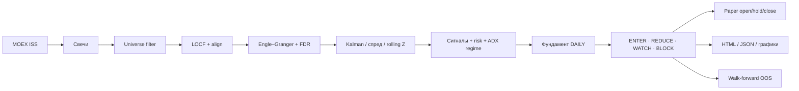

# TRINITY — Multi-Strategy Arbitrage

**Three Strategies. One Mission.**

**TRINITY** в замысле — три стратегии: (1) cointegration / pairs, (2) календарный арбитраж фьючерсов, (3) опционы. Сейчас полностью реализуем **п.1**: pairs в боковике на горизонте **нескольких дней** и **интрадей** (узкая книга 1–2 пары, профиль счёта от ~100 тыс. ₽). Пункты 2–3 — в дорожной карте, кода ещё нет.

Система загружает дневные свечи через MOEX ISS, отсекает тонкий рынок, тестирует пары Engle–Granger, считает спред / rolling Z-score (опционально Kalman-hedge), симулирует mean-reversion с risk-стопами, показывает графики, пропускает сигналы через новостной фильтр и ведёт **автоматический paper journal**.

> **Важно.** Это research / decision-support инструмент, а не автоисполняющий бот и не гарантия прибыли. Перед реальной торговлей нужна собственная валидация (walk-forward, paper-trading, учёт издержек шорта и проскальзывания).

---

## Возможности

| Модуль | Что делает |
|---|---|
| **Данные** | Состав IMOEX + дневные OHLCV с MOEX ISS, кэш в `data/candles/` |
| **Universe filter** | Pre-filter: медианный оборот, мин. цена, отсев preferred `*P` (proxy шорта) |
| **Коинтеграция** | Engle–Granger + FDR (Benjamini–Hochberg) |
| **Хедж** | Статический β или **Kalman** динамический hedge ratio |
| **Сигналы** | Rolling Z, вход после **разворота** за ±entry, выход ≈ 0, stop / time-stop |
| **Режим рынка** | ADX индекса: боковик / нейтраль / тренд — в TREND новые входы блокируются |
| **Risk** | stop-z (в т.ч. адаптивный), CUSUM, R² / half-life / min trades, лимит открытых пар |
| **Рекомендации** | Тексты «что купить/продать» + явный блок при тренде + итог ENTER / REDUCE / WATCH / BLOCK |
| **Новости / FA** | После техники, только DAILY: MOEX + опционально RSS → CONFLICT / ENTER / REDUCE / BLOCK |
| **Paper journal** | AUTO OPEN только после FA (в DAILY); MTM → AUTO CLOSE, PnL по qty×цена (+ slippage/borrow) |
| **Walk-forward** | OOS окна train/test по топ-парам |
| **Графики** | Свечи, дивергенция, спред + KAMA, Z со стрелками |
| **Auth** | HTTP Basic на mutating API (`POST /api/**`) |
| **UI** | HTML-дашборд TRINITY (операторский пульт) |

---

## Архитектура пайплайна



**Идея стратегии:** две акции обычно движутся вместе; если спред аномально расширился и Z **развернулся** к нулю — ставка на схождение (long одной ноги + short другой). Модуль рассчитан **только на боковик**: при высоком ADX индекса (режим TREND) новые входы блокируются.

---

## Пошаговый запуск

Ниже — полный путь от нуля до первого paper-цикла. Команды даны для **macOS / Linux** (`curl`) и **Windows** (`curl.exe`).

### 0. Что нужно заранее

| Требование | Проверка |
|---|---|
| **Java 17+** | `java -version` |
| **Maven 3.9+** | `mvn -v` |
| Интернет к `iss.moex.com` | браузер / `curl -I https://iss.moex.com` |
| Свободный порт **8080** | иначе смените `server.port` в `application.yml` |

Клон / каталог проекта:

```bash
cd /path/to/IMOEX          # macOS / Linux
# или
cd C:\path\to\IMOEX        # Windows
```

### 1. (Опционально) Прогнать тесты

```bash
mvn test
```

Все зелёные — можно запускать приложение.

### 2. Запустить сервер

**Терминал A** (оставьте открытым):

```bash
mvn spring-boot:run
```

Дождитесь строки:

```text
Started CointegrationApplication
```

Приложение слушает **http://localhost:8080**.

**Если порт занят**

macOS / Linux:

```bash
lsof -i :8080
kill <PID>
```

Windows:

```powershell
netstat -ano | findstr :8080
taskkill /PID <PID> /F
```

### 3. Локальные секреты (обязательно — иначе приложение не стартует)

В git **нет** паролей и unlock-ключа. Свечи и journal тоже не в репозитории (`/data/` в `.gitignore`).

```bash
cp application-local.yml.example application-local.yml
# отредактируйте imoex.run.unlock и imoex.auth.password
```

Либо через env:

```bash
export IMOEX_UNLOCK='длинная-случайная-строка'
export IMOEX_AUTH_PASSWORD='сильный-пароль'
```

Без `imoex.run.unlock` процесс сразу падает с понятной ошибкой — так публичный клон «из коробки» не работает. Это не DRM: исходники открыты, упорный человек может пропатчить guard; цель — не раздавать готовый запуск и не светить секреты.

В пульте `/view` и в `curl` используйте **свой** пароль из `application-local.yml`.

Проверка, что сервер жив (GET без пароля обычно ок):

```bash
curl -sS http://localhost:8080/actuator/health
```

### 4. Первый полный анализ (скачать свечи)

**Терминал B.** Первый раз обязательно `refresh=true` — качает историю по тикерам IMOEX (может занять **много минут**).

macOS / Linux:

```bash
curl -u "imoex:${IMOEX_AUTH_PASSWORD}" -X POST \
  "http://localhost:8080/api/analysis/run?refresh=true"
```

Windows (PowerShell, подставьте свой пароль):

```powershell
curl.exe -u "imoex:YOUR_PASSWORD" -X POST "http://localhost:8080/api/analysis/run?refresh=true"
```

Что происходит внутри:

1. Скачивание / обновление свечей → `data/candles/`  
2. **Universe filter** (оборот ≥ 50 млн ₽, цена ≥ 5 ₽, без `*P`)  
3. Engle–Granger + FDR → Kalman / rolling Z → метрики + risk  
4. Техсигналы (вход только после **разворота** Z)  
5. Новостной слой → ENTER / REDUCE / WATCH / BLOCK  
6. **Paper sync** — авто-открытие по ENTER  
7. Walk-forward по топ-парам (если включён)

В логе Терминала A ищите строки вроде `Universe filter: … → … tickers` и `Paper sync: opened=…`.

### 5. Повторный пересчёт без скачивания

Когда свечи уже есть (типичный будний день после первого прогона):

```bash
curl -u "imoex:${IMOEX_AUTH_PASSWORD}" -X POST \
  "http://localhost:8080/api/analysis/run?refresh=false"
```

Быстрее: только новости + paper sync (без полного Engle–Granger):

```bash
curl -u "imoex:${IMOEX_AUTH_PASSWORD}" -X POST \
  "http://localhost:8080/api/analysis/news-refresh"
```

### 6. Смотреть результаты в браузере

Откройте http://localhost:8080/view — сверху **пульт оператора**: кнопки «Анализ + paper», «Анализ + скачать свечи», «Только новости / paper», «Walk-forward», «Скачать свечи». Логин/пароль API — из `application-local.yml`, сохраняются в браузере. `curl` ниже — запасной путь.

| Шаг | URL | Зачем |
|---|---|---|
| 1 | http://localhost:8080/view | Дашборд + пульт |
| 2 | http://localhost:8080/view/final | Итог ENTER / REDUCE / BLOCK |
| 3 | http://localhost:8080/view/paper | Paper: открытые / закрытые, Net ₽ |
| 4 | http://localhost:8080/view/walk-forward | OOS Sharpe по окнам |
| 5 | http://localhost:8080/view/signals | Сырые LONG / SHORT |
| 6 | http://localhost:8080/view/charts/SBER/LKOH | График конкретной пары (подставьте тикеры) |

Корень `/` → редирект на `/view`.

### 7. Ежедневный режим (после первого прогона)

**Вариант A — вручную (торговый день, после закрытия):**

```bash
curl -u "imoex:${IMOEX_AUTH_PASSWORD}" -X POST \
  "http://localhost:8080/api/analysis/run?refresh=true"
```

Затем откройте `/view/paper` и `/view/final`.

**Вариант B — автомат:** при `imoex.paper.auto-run-daily: true` (по умолчанию) планировщик в **пн–пт ~19:05** сам гоняет полный цикл (свечи → анализ → paper), пока `mvn spring-boot:run` запущен.

На выходных новых дневных свечей нет — повтор почти ничего не меняет. Paper **не закрывает** стопом на той же свече, что и вход (защита от шума пересчёта Z).

### 8. Сброс paper journal (чистый track-record)

1. Остановите приложение.  
2. Удалите `data/paper-journal.json`.  
3. Запустите снова и сделайте `POST …/analysis/run?refresh=false`.

### 9. Чеклист «всё ок»

- [ ] `Started CointegrationApplication` в логе  
- [ ] `POST /api/analysis/run` вернул JSON / не 401 (логин верный)  
- [ ] В `data/candles/` появились JSON-файлы тикеров  
- [ ] `/view/final` показывает пары и решения  
- [ ] `/view/paper` не пустой после ENTER (или пустой осознанно — нет сигналов / близко к стопу)  
- [ ] На графике Z стрелки входа только после разворота к нулю  

---

## Как читать результаты

### Технические сигналы

| Сигнал | Смысл |
|---|---|
| **КУПИТЬ спред** (`LONG_SPREAD`) | Z был ≤ −entry и развернулся вверх → купить Y, продать X |
| **ПРОДАТЬ спред** (`SHORT_SPREAD`) | Z был ≥ +entry и развернулся вниз → продать Y, купить X |
| **НАБЛЮДАТЬ / ЖДЁМ РАЗВОРОТ** | \|Z\| за порогом, но ещё расширяется — **не входить** |
| **Не торговать (тренд)** | Режим TREND по ADX — стратегия только боковик, входы запрещены |
| **ЖДАТЬ / ПРОПУСК** | Нет входа или не прошли фильтры качества |

Колонка **«Дата»** у пары — дата **последней общей свечи**.  
**«Дата анализа»** — когда вы запускали `POST /api/analysis/run`.

### Итог после фундамента (`/view/final`)

Порядок: **техника → фундамент → рекомендация → paper**. FA только в **DAILY / multi-day** (несколько дней); в INTRADAY пропускается.

| Итог | Действие |
|---|---|
| **ENTER** | Техника ок, блокеров нет |
| **REDUCE** | CONFLICT средней силы — уменьшенный размер |
| **WATCH** | Не входить, наблюдать (в т.ч. тренд / нет разворота) |
| **BLOCK** | CONFLICT / запрет (earnings miss, SPO, делистинг, halt, …) |

На дашборде баннер **«Режим рынка»** (ADX): SIDEWAYS / NEUTRAL / TREND.

Источники FA: MOEX sitenews + опционально RSS Interfax/RBC (`imoex.news.rss-enabled`).

### Paper journal (`/view/paper`)

| Поле | Смысл |
|---|---|
| **OPEN** | Бумажная позиция открыта |
| **CLOSED** | Закрыта (mean-reversion / stop / time-stop / разворот сигнала) |
| **Realized ₽** | PnL закрытых сделок (qty×цена ног, − slippage/borrow) |
| **Unrealized ₽** | Mark-to-market открытых |
| **Net ₽** | Realized + Unrealized |

Это **не** брокерский P&L: модель упрощает исполнение и издержки, но уже не «1 Z ≈ 1%».

### График пары

1. Свечи Y  
2. Свечи X  
3. Дивергенция (норм. цены от 100)  
4. Спред + **KAMA**  
5. Z-score: ±entry, ▲ купить, ▼ продать (после разворота), ● выход / «ждём разворот»  

---

## REST API

Базовый префикс: `/api`.  
**POST** требуют `-u imoex:$IMOEX_AUTH_PASSWORD` (если `imoex.auth.enabled=true`).

| Метод | Путь | Описание |
|---|---|---|
| `POST` | `/data/refresh` | Только скачать свечи |
| `POST` | `/analysis/run?refresh=true\|false` | Полный анализ (+ paper + walk-forward) |
| `POST` | `/analysis/news-refresh` | Новости + paper sync |
| `POST` | `/analysis/walk-forward?maxPairs=10` | Пересчёт OOS |
| `GET` | `/analysis/walk-forward` | Последний WF-отчёт |
| `GET` | `/paper/journal` | Paper track-record |
| `GET` | `/risk/policy` | Risk policy |
| `GET` | `/analysis/report` | Сводка отчёта |
| `GET` | `/analysis/top-pairs` | Топ-N по Sharpe |
| `GET` | `/analysis/recommendations` | Все техрекомендации |
| `GET` | `/analysis/signals` | Только LONG/SHORT |
| `GET` | `/analysis/final` | Итог техника + новости |
| `GET` | `/charts/{Y}/{X}/data` | JSON графика |
| `GET` | `/charts/{Y}/{X}/spread` | PNG спреда |
| `GET` | `/charts/{Y}/{X}/zscore` | PNG Z-score |
| `GET` | `/actuator/health` | Healthcheck |

Пример:

```bash
curl -u "imoex:${IMOEX_AUTH_PASSWORD}" -sS "http://localhost:8080/api/analysis/final" | head
curl -u "imoex:${IMOEX_AUTH_PASSWORD}" -sS "http://localhost:8080/api/paper/journal" | head
```

---

## Конфигурация

Файл: `src/main/resources/application.yml` (ключевые блоки):

```yaml
server:
  port: 8080

imoex:
  commission-rate: 0.0005
  cointegration:
    p-value-threshold: 0.05
    z-score-entry: 2.0
    z-score-exit: 0.0
    top-n: 10
    use-rolling-z: true
    rolling-z-window: 60
    fdr-q: 0.10
    use-kalman-hedge: true
    require-entry-reversal: true   # вход только после разворота Z
  universe:
    enabled: true
    lookback-days: 60
    min-median-turnover-rub: 50000000  # ~p25 IMOEX
    min-price: 5.0
    max-zero-volume-fraction: 0.15
    exclude-preferred: true            # SBERP, SNGSP, …
  risk:
    stop-z: 3.5
    max-hold-bars: 40
    max-open-pairs: 2
    trade-max-half-life-days: 15.0
    min-r-squared: 0.70
    borrow-rate-annual: 0.08
  regime:
    enabled: true
    adx-reduce: 20.0
    adx-block: 25.0
  capital:
    equity-rub: 100000
    allow-leverage-above-rub: 1000000
  walk-forward:
    enabled: true
    train-bars: 504
    test-bars: 63
    step-bars: 63
  paper:
    enabled: true
    notional-per-leg: 30000
    journal-file: paper-journal.json
    auto-run-daily: true
    daily-cron: "0 5 19 * * MON-FRI"
    slippage-bps: 20
  auth:
    enabled: true
    username: imoex
    # password и unlock — только в application-local.yml / env, не в git
```

| Модуль | Конфиг | Где видно |
|---|---|---|
| Universe filter | `imoex.universe.*` | до EG в `/analysis/run` |
| Entry reversal | `require-entry-reversal` | сигналы + график |
| Kalman / rolling Z / FDR | `use-kalman-hedge`, `use-rolling-z`, `fdr-q` | метрики пар |
| Regime (ADX) | `imoex.regime.*` | баннер на дашборде, блок входов |
| Risk | `imoex.risk.*` | `GET /api/risk/policy` |
| Walk-forward | `imoex.walk-forward.*` | `/view/walk-forward` |
| Paper | `imoex.paper.*` | `/view/paper` |
| Auth | `imoex.auth.*` | HTTP Basic на POST |

---

## Структура проекта

```text
IMOEX/
├── src/main/java/com/moex/cointegration/
│   ├── client/          # MOEX ISS: свечи, новости, статус
│   ├── config/          # properties + Security
│   ├── controller/      # REST + HTML
│   ├── model/           # DTO / records
│   ├── news/            # триггеры заголовков
│   ├── quant/           # ADF, EG, OLS, Spread, KAMA, Kalman, SignalRules, WF
│   ├── scheduler/       # weekly + daily paper cron
│   ├── service/         # анализ, paper, universe filter, …
│   ├── storage/         # JSON-кэш
│   └── web/             # HTML-рендер
├── src/main/resources/application.yml
├── src/test/java/
├── pom.xml
└── data/                # свечи, отчёты, paper (в .gitignore)
```

### Локальные артефакты (`data/`)

| Файл / папка | Содержимое |
|---|---|
| `candles/*.json` | Дневные OHLCV |
| `analysis-report.json` | Отчёт + топ-пары |
| `trading-recommendations.json` | Техрекомендации |
| `final-recommendations.json` | Итог после новостей |
| `paper-journal.json` | Paper track-record |
| `walk-forward-report.json` | OOS отчёт |
| `charts/` | PNG (запасной формат) |

---

## Методология (кратко)

1. **Загрузка** тикеров IMOEX и дневных свечей за `history-years`.  
2. **Universe filter:** медианный оборот, мин. цена, без preferred `*P`.  
3. **LOCF**; выравнивание **попарно** по общим датам.  
4. **Engle–Granger** + **FDR** по p-value.  
5. Спред (статический или **Kalman** β), **rolling Z**.  
6. **Режим рынка (ADX):** в TREND — не торговать (стратегия только боковик).  
7. Симуляция mean-reversion: commission + borrow, stop-z / adaptive / CUSUM, **entry reversal**.  
8. Топ-N по Sharpe; сигналы по коинтегрированным парам.  
9. **Фундамент (только DAILY):** MOEX + опционально RSS → CONFLICT / ENTER / REDUCE / WATCH / BLOCK.  
10. **Paper** sync только после FA (cash PnL) + опционально **walk-forward** OOS.

### Новостные триггеры (примеры)

- **BLOCK:** приостановка торгов, делистинг, санкции, банкротство/дефолт, M&A, stale свечи  
- **HIGH:** дискретный аукцион, оферта, SPO  
- **MEDIUM:** дивиденды, buyback, смена менеджмента, риск-параметры MOEX  

---

## Тесты

```bash
mvn test
mvn verify   # + JaCoCo gate
```

Отчёт: `target/site/jacoco/index.html`.

Покрыты ADF / EG / SpreadAnalytics / Kalman / SignalRules / universe filter /
walk-forward / FDR / рекомендации / news / clients / controllers / paper / pipeline.

---

## Ограничения

- Нет брокера и автоисполнения.  
- Возможен look-ahead / overfitting при наивном чтении in-sample Sharpe.  
- Paper PnL — research-метрика по qty×цене (+ упрощённый slippage/borrow), не брокерский отчёт.  
- Shortability без брокера — приближение (ликвидность + exclude preferred).  
- Коинтеграция может сломаться; в тренде стратегия намеренно не торгует.  
- **Не является** индивидуальной инвестиционной рекомендацией.

Путь к live: universe filter → rolling Z → walk-forward → paper → жёсткий risk → только потом брокерский API.

---

## Стек

Java 17 · Spring Boot 3.3 · Apache Commons Math 3 · JFreeChart · Lightweight Charts · Jackson · Maven · Spring Security (Basic) · Actuator

---

## Лицензия и данные

Код проекта — мой; рыночные данные принадлежат **Московской бирже** (публичный ISS API и его условия).

---

<sub>IMOEX Cointegration — от сырых свечей до ENTER / paper track-record</sub>
