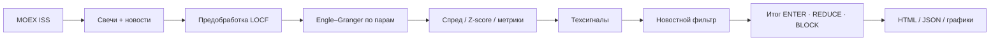

# IMOEX Cointegration

**Поиск коинтегрированных пар акций индекса МосБиржи и торговые рекомендации для дневной / свинговой парной торговли.**

Система загружает дневные свечи через MOEX ISS, тестирует пары методом Engle–Granger, считает спред и Z-score, строит бэктест mean-reversion, показывает интерактивные графики и пропускает сигналы через новостной safety-layer.

> **Важно.** Это research / decision-support инструмент, а не автоисполняющий бот и не гарантия прибыли. Перед реальной торговлей нужна собственная валидация (walk-forward, paper-trading, учёт издержек шорта).

---

## Возможности

| Модуль | Что делает |
|---|---|
| **Данные** | Состав IMOEX + дневные OHLCV с MOEX ISS, локальный кэш в `data/candles/` |
| **Коинтеграция** | Попарный Engle–Granger (ADF на остатках, MacKinnon CV, BIC-лаги) |
| **Сигналы** | Z-score вход ±2.0, выход ≈ 0, half-life, Sharpe, max drawdown |
| **Рекомендации** | Подробные тексты «для новичка»: что купить/продать и когда выходить |
| **Графики** | Свечи Y/X, дивергенция, спред + **KAMA**, Z-score со стрелками входа/выхода |
| **Новости** | Фильтр по MOEX sitenews + статус бумаги → **ENTER / REDUCE / WATCH / BLOCK** |
| **UI** | HTML-дашборд в браузере + JSON REST API |

---

## Архитектура пайплайна



**Идея стратегии (pair trading):**  
если две акции обычно движутся вместе, а спред аномально расширился, ставка делается на **схождение** — одновременно long одной ноги и short другой (market-neutral по замыслу).

---

## Быстрый старт

### Требования

- **Java 17+** (проверялось также на JDK 24)
- **Maven 3.9+**
- Доступ в интернет к `iss.moex.com`

### Запуск

```powershell
cd C:\Users\i.tyulkin\Projects\imoex-cointegration
mvn spring-boot:run
```

Дождитесь строки:

```text
Started CointegrationApplication
```

Приложение слушает **http://localhost:8080**

Если порт занят:

```powershell
netstat -ano | findstr :8080
taskkill /PID <PID> /F
```

### Первый анализ

В **втором** окне терминала:

```powershell
# Полный цикл: обновить свечи с MOEX + пересчитать пары + новости
curl.exe -X POST "http://localhost:8080/api/analysis/run?refresh=true"
```

`refresh=true` может занять много минут (скачивание истории по тикерам).  
Повторный пересчёт на уже скачанных данных:

```powershell
curl.exe -X POST "http://localhost:8080/api/analysis/run?refresh=false"
```

Только обновить новостной слой (без Engle–Granger):

```powershell
curl.exe -X POST "http://localhost:8080/api/analysis/news-refresh"
```

### Открыть в браузере

| Страница | URL |
|---|---|
| Дашборд | http://localhost:8080/view |
| **Итог + новости** | http://localhost:8080/view/final |
| Техсигналы | http://localhost:8080/view/signals |
| Все рекомендации | http://localhost:8080/view/recommendations |
| График пары | http://localhost:8080/view/charts/{Y}/{X} |

Корень `/` перенаправляет на `/view`.

---

## Как читать результаты

### Технические сигналы

| Сигнал | Смысл |
|---|---|
| **КУПИТЬ спред** (`LONG_SPREAD`) | Z ≤ −entry → купить Y, продать X |
| **ПРОДАТЬ спред** (`SHORT_SPREAD`) | Z ≥ +entry → продать Y, купить X |
| **НАБЛЮДАТЬ** | Спред расширяется, порог ещё не пробит |
| **ЖДАТЬ / ПРОПУСК** | Нет входа или пара не прошла фильтры качества |

Колонка **«Дата»** у пары — дата **последней общей свечи**, не обязательно «сегодня».  
Карточка **«Дата анализа»** — когда вы запускали `POST /api/analysis/run`.

### Итог после новостей (`/view/final`)

| Итог | Действие |
|---|---|
| **ENTER** | Техника ок, блокеров нет — можно разбирать размер |
| **REDUCE** | Есть caution-триггеры — вход только уменьшенным размером |
| **WATCH** | Не входить, наблюдать |
| **BLOCK** | Вход запрещён (делистинг, стоп торгов, протухшие данные и т.п.) |

### График пары

1. Свечи Y  
2. Свечи X  
3. Дивергенция (нормализованные цены от 100)  
4. Спред + **Kaufman Adaptive MA (KAMA)**  
5. Z-score: уровни ±entry, ▲ зелёная = купить спред, ▼ красная = продать, ● серый = выход  

---

## REST API

Базовый префикс: `/api`

| Метод | Путь | Описание |
|---|---|---|
| `POST` | `/data/refresh` | Скачать свечи IMOEX |
| `POST` | `/analysis/run?refresh=true\|false` | Полный анализ (+ опционально refresh) |
| `POST` | `/analysis/news-refresh` | Пересчитать только новости (+ paper sync) |
| `POST` | `/analysis/walk-forward?maxPairs=10` | OOS walk-forward по топ-парам |
| `GET` | `/analysis/walk-forward` | Последний walk-forward отчёт |
| `GET` | `/paper/journal` | Paper track-record |
| `GET` | `/risk/policy` | Текущая risk policy |
| `GET` | `/analysis/report` | Сводка последнего отчёта |
| `GET` | `/analysis/top-pairs` | Топ-N по Sharpe |
| `GET` | `/analysis/recommendations` | Все техрекомендации |
| `GET` | `/analysis/signals` | Только LONG/SHORT |
| `GET` | `/analysis/final` | Итог техника + новости |
| `GET` | `/charts/{Y}/{X}/data` | JSON для интерактивного графика |
| `GET` | `/charts/{Y}/{X}/spread` | PNG спреда |
| `GET` | `/charts/{Y}/{X}/zscore` | PNG Z-score |

Пример:

```powershell
curl.exe "http://localhost:8080/api/analysis/final"
```

---

## Конфигурация

Файл: `src/main/resources/application.yml`

```yaml
server:
  port: 8080

imoex:
  base-url: https://iss.moex.com/iss
  board: TQBR
  index: IMOEX
  history-years: 5
  commission-rate: 0.0005          # 0.05% на ногу в симуляции
  cointegration:
    p-value-threshold: 0.05
    z-score-entry: 2.0
    z-score-exit: 0.0
    top-n: 10
  data-dir: data
  charts-dir: data/charts
  news:
    enabled: true
    lookback-days: 10              # окно новостей (дни)
    stale-candle-days: 10          # старше → BLOCK
    max-news-pages: 8

analysis:
  schedule:
    enabled: false                 # true — еженедельный cron
    cron: "0 0 6 * * SUN"
```

---

## Структура проекта

```text
imoex-cointegration/
├── src/main/java/com/moex/cointegration/
│   ├── client/          # MOEX ISS: свечи, новости, статус бумаг
│   ├── config/          # application properties
│   ├── controller/      # REST + HTML
│   ├── model/           # DTO / records
│   ├── news/            # триггеры заголовков новостей
│   ├── quant/           # ADF, Engle–Granger, OLS, спред, KAMA
│   ├── scheduler/       # опциональный weekly job
│   ├── service/         # оркестрация анализа и рекомендаций
│   ├── storage/         # локальный JSON-кэш
│   └── web/             # HTML-рендер
├── src/main/resources/application.yml
├── src/test/java/       # unit-тесты quant / news / services
└── data/                # свечи, отчёты, рекомендации (в .gitignore)
```

### Локальные артефакты (`data/`)

| Файл / папка | Содержимое |
|---|---|
| `candles/*.json` | Дневные OHLCV по тикерам |
| `analysis-report.json` | Отчёт + топ-пары с рядами |
| `trading-recommendations.json` | Техрекомендации |
| `final-recommendations.json` | Итог после новостей |
| `charts/` | PNG-графики (запасной формат) |

---

## Методология (кратко)

1. **Загрузка** тикеров IMOEX и дневных свечей за `history-years`.  
2. **LOCF** для пропусков; выравнивание **попарно** по общим датам (не глобальное пересечение всех тикеров).  
3. **Engle–Granger:** OLS `logY ~ logX`, ADF на остатках без константы, критические значения для коинтеграции.  
4. **Спред** = `logY − (α + β·logX)`, **Z-score** по истории спреда.  
5. **Симуляция** mean-reversion с комиссией → Sharpe, max DD, half-life, число сделок.  
6. **Топ-N** по Sharpe сохраняется в отчёт; сигналы строятся по всем коинтегрированным парам.  
7. **Новости:** MOEX sitenews + tradability + stale data → финальный вердикт.

### Новостные триггеры (примеры)

- **BLOCK:** приостановка торгов, делистинг, санкции, банкротство/дефолт, M&A/реорганизация, неторгуемая бумага, устаревшие свечи  
- **HIGH:** дискретный аукцион, оферта, SPO/допэмиссия  
- **MEDIUM:** дивиденды, buyback, смена менеджмента, риск-параметры MOEX, отсутствие в актуальном индексе  

---

## Тесты

```powershell
mvn test
# отчёт + gate покрытия (минимум 40% line, без model/web)
mvn verify
```

Отчёт JaCoCo: `target/site/jacoco/index.html`.

Покрыты ADF / Engle–Granger / **SpreadAnalytics** (Z, rolling Z, half-life, бэктест, stops),
walk-forward + FDR, предобработка, рекомендации, news, clients (MockRest),
controllers (MockMvc), pipeline, storage, paper journal.

---

## Risk / Walk-forward / Paper / Auth

| Модуль | Конфиг | API |
|---|---|---|
| **Rolling Z + FDR** | `imoex.cointegration.use-rolling-z`, `rolling-z-window`, `fdr-q` | внутри `/api/analysis/run` |
| **Risk policy** | `imoex.risk.*` (stop-z, max-hold-bars, reduce-size-factor, max-open-pairs) | `GET /api/risk/policy` |
| **Walk-forward** | `imoex.walk-forward.*` | `POST/GET /api/analysis/walk-forward` |
| **Paper journal** | `imoex.paper.*` | `GET /api/paper/journal` |
| **Auth** | `imoex.auth.enabled=true` (по умолчанию) + username/password | HTTP Basic на `POST /api/**` |

Логин по умолчанию: `imoex` / `change-me`. Смените пароль перед выкладкой наружу.

Пример:

```powershell
curl.exe -u imoex:change-me -X POST "http://localhost:8080/api/analysis/run?refresh=false"
```

Actuator: `GET /actuator/health`.

---

## Ограничения и честный дисклеймер

- Нет интеграции с брокером и автоисполнения ордеров.  
- Z-score и метрики считаются на историческом окне; возможен **look-ahead / overfitting** при наивной интерпретации Sharpe.  
- Издержки шорта, проскальзывание и ликвидность учтены упрощённо.  
- Коинтеграция может «сломаться» — новостной фильтр снижает, но не устраняет этот риск.  
- Проект **не является** индивидуальной инвестиционной рекомендацией.

Рекомендуемый путь к live: rolling Z → walk-forward → paper journal → жёсткие лимиты риска → только потом брокерский API.

---

## Типичный рабочий день

1. `mvn spring-boot:run`  
2. `POST /api/analysis/run?refresh=true` (или `false`, если свечи свежие)  
3. Открыть **http://localhost:8080/view/final**  
4. Пары с **ENTER / REDUCE** → открыть **График** → сверить стрелки и KAMA  
5. При необходимости днём: `POST /api/analysis/news-refresh`  

---

## Стек

- Java 17 · Spring Boot 3.3  
- Apache Commons Math 3  
- JFreeChart (PNG) · Lightweight Charts (браузер)  
- Jackson · Maven  

---

## Лицензия и данные

Код проекта — ваш; рыночные данные принадлежат **Московской бирже** и предоставляются через публичный ISS API с его условиями использования.

---

<p align="center">
  <sub>IMOEX Cointegration — от сырых свечей до итоговой таблицы ENTER / REDUCE / BLOCK</sub>
</p>
